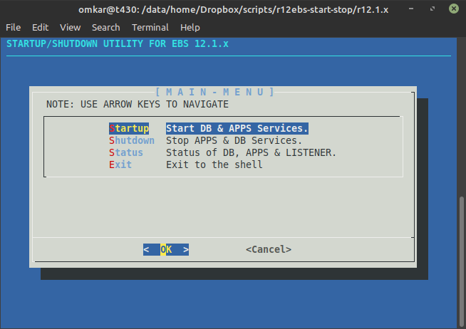
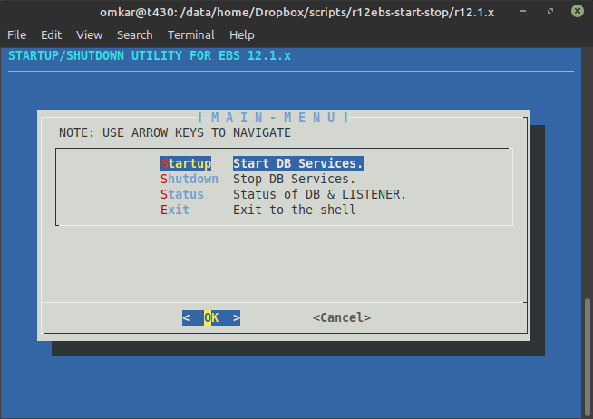
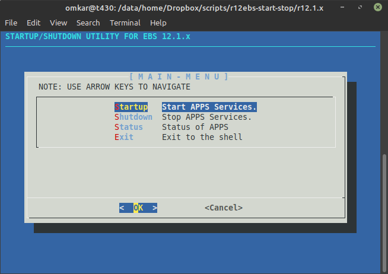
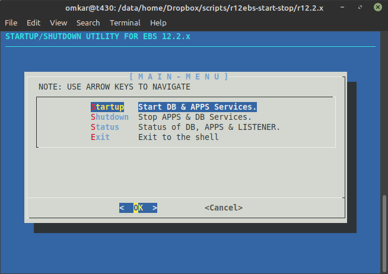
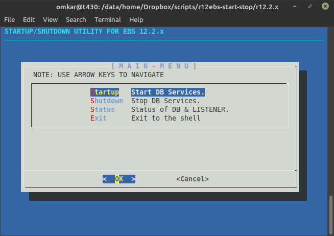
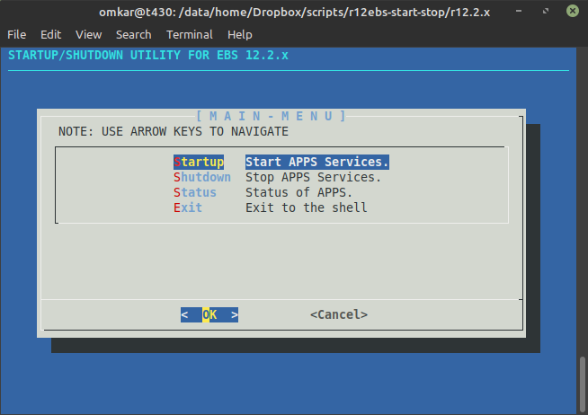

### Startup / Shutdown Utility for Oracle E-Business Suite Release v12.1.x and v12.2.x.

#### Screenshots : R12.1.x
 

{ width=50% }
{ width=50% }

#### Screenshots : R12.2.x
{ width=50% }
{ width=50% }
{ width=50% }
